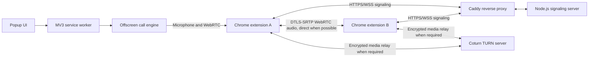

# Vina Voice Chatting Extension

A Chrome Manifest V3 extension for private voice rooms with up to 10 participants. The extension captures microphone audio and negotiates a WebRTC connection with each other participant. A small Node.js WebSocket service coordinates room membership and exchanges WebRTC session descriptions and ICE candidates. Media travels directly between peers when possible; if their networks cannot connect directly, Coturn can relay the encrypted WebRTC media.

This repository contains the extension, signaling service, tests, and a self-hosted Docker Compose deployment scaffold using Caddy and Coturn. The scaffold is not a deployed service: an operator must provide a domain, server, DNS, secrets, firewall access, and a stable extension ID.

## Contents

- [Architecture](#architecture)
- [Features and scope](#features-and-scope)
- [Requirements](#requirements)
- [Run locally](#run-locally)
- [Load the extension](#load-the-extension)
- [Configuration reference](#configuration-reference)
- [Production deployment](#production-deployment)
- [Security and privacy](#security-and-privacy)
- [Tests and validation](#tests-and-validation)
- [Troubleshooting](#troubleshooting)
- [Known limitations](#known-limitations)

## Architecture



The popup is the short-lived control surface. The Manifest V3 service worker creates and coordinates the offscreen document, which owns microphone capture, WebSocket signaling, and the `RTCPeerConnection`. Closing the popup does not intentionally end an active call. The signaling service does not process call audio. Coturn relays media only when ICE cannot establish a direct route; WebRTC media is protected by DTLS-SRTP.

### Call setup

1. The room creator generates a 24-byte cryptographically random room code and joins as the host.
2. Up to nine additional participants enter the code and join the room. The first participant is the host.
3. The signaling server returns STUN servers and, when configured, a short-lived Coturn username and credential.
4. Each new participant negotiates a WebRTC connection with the participants already in the room. Peers exchange SDP offers, answers, and ICE candidates through the signaling socket.
5. The browsers establish peer-to-peer audio routes. Coturn relays encrypted media when direct connectivity is unavailable.

## Features and scope

- Create and join rooms of up to 10 participants using a high-entropy invite code.
- Microphone permission handling and audio processing preferences for echo cancellation, noise suppression, and automatic gain control.
- Mute/unmute, leave-call controls, connection status, and room-code copying.
- Incoming call volume slider with audio gain up to 200%.
- Host controls to mute, unmute, or remove another participant from the room.
- Call engine in an MV3 offscreen document so calls can continue while the popup is closed.
- WebSocket signaling with room membership, role validation, SDP/ICE payload bounds, configurable connection/room limits, origin allowlisting, heartbeat checks, and graceful shutdown.
- Coturn REST credentials generated by the signaling server; the TURN shared secret is not included in the extension.
- Docker Compose deployment scaffold with Caddy automatic HTTPS for WSS and a separately managed Coturn service.

This is a small peer-to-peer voice room, not a large-scale group chat, identity system, or hosted product. Room codes are bearer invitations: anyone who learns a code can try to join its room.

## Requirements

For local development:

- A recent Google Chrome version that supports Manifest V3 offscreen documents and WebRTC.
- Node.js 22 or another currently supported Node.js LTS release, with npm.
- Windows, macOS, or Linux for the signaling server.

For the supplied production deployment:

- A Linux host with Docker Engine and the Docker Compose plugin.
- A public domain whose DNS points to the host.
- A publicly reachable IPv4 address for Coturn. If the host is behind NAT, Coturn must be configured for the public/private address mapping.
- Firewall access to the ports listed in [Production deployment](#production-deployment).
- A stable Chrome extension ID to use in the production origin allowlist.

## Run locally

Open a terminal at the repository root and run:

```powershell
Set-Location server
npm ci
npm start
```

The signaling server listens on `http://0.0.0.0:3000`. For local health checks, open `http://127.0.0.1:3000/health`; it should return:

```json
{"status":"ok"}
```

The extension's default signaling URL is `ws://localhost:3000/signal`. This is permitted only for localhost development. A remote signaling endpoint must use `wss://`.

The development server uses the public Google STUN endpoint by default and has no TURN credentials unless configured. Two participants on the same machine or an uncomplicated network may connect; direct connectivity is not guaranteed on restrictive networks. Follow [Production deployment](#production-deployment) to configure TURN.

## Load the extension

1. Start the signaling server as described above.
2. Open `chrome://extensions` in Chrome and enable **Developer mode**.
3. Select **Load unpacked** and choose this repository's `extension` directory.
4. Open the Voice Chat popup. For a local server on the same computer, keep the URL as `ws://localhost:3000/signal`.
5. Participant A selects **Create room**, then shares the code privately.
6. Participant B enters the code and selects **Join**.
7. Both participants approve Chrome's microphone prompt. Use the microphone button to mute/unmute and **Leave call** to end the session.

If Chrome blocks remote audio playback, reopen the popup and select **Enable audio**. The call engine is in an offscreen extension document, so the popup can close while the call continues. Reloading or removing the unpacked extension ends the call.

For a local two-person test on one computer, load the same extension in two separate Chrome profiles. For a meaningful network test, use two devices or networks. Chrome's extension origin must be added to the production server allowlist before it can connect there.

## Configuration reference

The local signaling server reads environment variables from its process. Docker Compose reads the root `.env` file, which is intentionally ignored by Git. Copy `.env.example` to `.env` only for deployment, and replace all example values.

| Variable | Required in production | Purpose |
| --- | --- | --- |
| `DOMAIN` | Yes, Compose | Public hostname used by Caddy for HTTPS/WSS. |
| `ALLOWED_ORIGINS` | Yes | Comma-separated, exact browser origins. Use `chrome-extension://<stable-id>` for the published extension build. |
| `TURN_EXTERNAL_IP` | Yes, Compose | Public IPv4 address Coturn advertises in ICE relay candidates. |
| `TURN_REALM` | Yes, Compose | Coturn authentication realm; normally the TURN hostname. |
| `TURN_URLS` | Yes | Comma-separated reachable `turn:` or `turns:` URLs returned to joining clients. |
| `TURN_SHARED_SECRET` | Yes | At least 32 bytes; used by the signaling server and Coturn to create/verify ephemeral credentials. Never put this in extension files or Git. |
| `TURN_CREDENTIAL_TTL_SECONDS` | No | Credential lifetime, capped at 3600 seconds; defaults to one hour. |
| `TURN_TLS` | No | Set to `true` only after installing and renewing Coturn's separate TLS certificate. |
| `STUN_URLS` | No | Comma-separated STUN URLs; defaults to Google's public STUN service. |
| `MAX_ROOMS` | No | In-memory room cap; defaults to 5000. |
| `MAX_CONNECTIONS` | No | Concurrent signaling connection cap; defaults to 1000. |
| `HOST` | No | Signaling bind address; defaults to `0.0.0.0`. |
| `PORT` | No | Signaling HTTP/WebSocket port; defaults to `3000`. |

Production mode (`NODE_ENV=production`) refuses to start without `ALLOWED_ORIGINS`, `TURN_URLS`, and a `TURN_SHARED_SECRET` of at least 32 bytes. Origins must be exact HTTPS web origins or valid Chrome extension origins. Do not use wildcard origins.

## Production deployment

The Compose stack runs three services:

- **Caddy** terminates HTTPS and proxies `/signal` WebSocket traffic and `/health` requests to the signaling service.
- **Signaling** runs the Node.js server on the private Compose network. Port 3000 is not published to the Internet.
- **Coturn** serves STUN/TURN on the host's public network. The signaling server creates time-limited REST credentials; Coturn validates those credentials against the shared secret.

### Prepare the host

1. Provision and patch a Linux VPS. Install Docker Engine and the Docker Compose plugin.
2. Create a DNS A record pointing the service domain at the VPS's public IPv4 address. Add AAAA only if IPv6 is configured and reachable end to end.
3. Configure both the provider firewall and host firewall:
   - TCP 80 and TCP 443 for Caddy certificate issuance and HTTPS/WSS.
   - UDP and TCP 3478 for Coturn TURN.
   - UDP 49160-49200 for Coturn relay allocations.
   - TCP 5349 only if optional TURN over TLS is enabled.
   - Restrict SSH to trusted administrative sources where possible.
4. Confirm that the VPS public IP is reachable directly. When the VPS uses NAT, configure Coturn's `external-ip` setting to map the public and private addresses correctly; edit the Coturn command in `docker-compose.yml` if your topology needs an explicit mapping.

### Configure and start

From the repository root on the VPS:

```sh
cp .env.example .env
openssl rand -hex 32
```

Paste the generated value into `TURN_SHARED_SECRET` in `.env`, then replace:

- `DOMAIN` with the public signaling hostname.
- `ALLOWED_ORIGINS` with the exact `chrome-extension://<id>` origin shown by Chrome for the distributed extension. Keep the ID stable across releases; allow multiple IDs only when those are intentional separate builds.
- `TURN_EXTERNAL_IP` with the VPS public IPv4 address.
- `TURN_REALM` and the hostnames in `TURN_URLS` with the intended TURN hostname. The defaults use UDP and TCP on port 3478.

Keep `.env` readable only by the deployment administrator. Do not commit it, paste its secret into support logs, or include secrets in issue reports. Then validate and start the stack:

```sh
docker compose config
docker compose build
docker compose up -d
docker compose ps
docker compose logs --tail=100
```

Caddy can obtain and renew the signaling HTTPS certificate automatically when public DNS is correct and TCP 80/443 reach the host. Configure the extension's signaling URL as `wss://<DOMAIN>/signal`. The health URL is `https://<DOMAIN>/health`.

### Optional TURN over TLS

The baseline relays WebRTC media using UDP/TCP TURN on port 3478. WSS protects signaling; it does not tunnel TURN. WebRTC media remains encrypted using DTLS-SRTP, including when relayed.

To offer TURN over TLS to networks that restrict UDP:

1. Obtain a Coturn certificate whose names match the TURN hostname.
2. Place `fullchain.pem` and `privkey.pem` in `coturn/certs/` on the VPS. Protect the private key and arrange its renewal; this Compose stack does not provision or renew this separate certificate.
3. Set `TURN_TLS=true` in `.env` and add `turns:<TURN_HOSTNAME>:5349?transport=tcp` to `TURN_URLS`.
4. Allow inbound TCP 5349, then recreate the Coturn container with `docker compose up -d --force-recreate coturn`.

TURN over TLS improves compatibility with some restrictive networks but cannot bypass every firewall policy. Verify relay candidates and actual calls from the networks your users depend on.

### Updates and operations

- Review and update the Node.js and container base images regularly; rebuild and test before rollout.
- Use `docker compose logs -f signaling caddy coturn` for service logs. Avoid sharing logs without checking for sensitive operational information.
- Check `https://<DOMAIN>/health`, container health, disk space, memory, CPU, and network/relay usage.
- Back up Caddy's data volume if you need to preserve certificate state. Store `.env` and Coturn private keys in a managed secret/backup system, never in the repository.
- Rotate `TURN_SHARED_SECRET` in a planned maintenance window by updating both services and recreating them together; existing TURN allocations may be interrupted.
- Test a new extension release with two browsers on separate networks before distributing it.

## Security and privacy

- Extension microphone capture requires the user's Chrome permission. The signaling server receives room codes and signaling metadata, not microphone audio.
- WSS protects signaling in production. WebRTC encrypts media with DTLS-SRTP; Coturn relays encrypted packets when direct connectivity fails.
- TURN's long-lived shared secret stays on the server. The signaling service sends clients only time-limited credentials created in Coturn REST format.
- The production origin allowlist reduces unwanted browser-origin connections. It is not user authentication; a non-browser client can spoof an Origin header.
- Room codes are the access mechanism. Treat a code like a private invitation and do not post it publicly.
- The service has no accounts, identity verification, room passwords, persistent room storage, moderation, or abuse-reporting tools.
- The Compose stack is a single-host deployment. Rooms are in memory and are lost when the signaling process restarts. It does not provide high availability, multi-instance coordination, or autoscaling.

## Tests and validation

Run from the repository root:

```powershell
Set-Location server
npm ci
npm test
npm run check
npm audit --omit=dev
```

The tests cover room joining and signaling relay, participant and room limits, host-role handoff and moderation, malformed payload rejection, production configuration and origin checks, and Coturn credential generation. The checks syntax-validate the server, tests, and extension JavaScript.

Before deployment, also run `docker compose config` and `docker compose build` on a machine with Docker. Automated tests do not replace a real Chrome call using microphones on separate networks.

## Troubleshooting

| Symptom | Checks |
| --- | --- |
| `npm start` reports no `package.json` | Run it from `server/`: `Set-Location server; npm start` in PowerShell, or `cd server && npm start` in a POSIX shell. |
| Popup cannot reach local signaling | Verify the server is running, check `http://127.0.0.1:3000/health`, and leave the URL as `ws://localhost:3000/signal` for a same-computer local test. |
| Production WebSocket closes immediately | Check that the extension ID exactly matches `ALLOWED_ORIGINS`, the URL is `wss://<DOMAIN>/signal`, DNS resolves, Caddy is healthy, and the Chrome permission for that server was granted. |
| Microphone permission fails | Check Chrome's site/extension microphone permissions, the selected input device, OS privacy permissions, and whether another application has exclusive device access. |
| Call stays on “Connecting” or reports no route | Verify Coturn is running, `TURN_EXTERNAL_IP` and `TURN_URLS` are correct, TURN shared secrets match, and provider/host firewalls allow ports 3478 and 49160-49200. TURN may be necessary even if STUN works on another network. |
| Remote participant is silent | Check the operating system output device and volume. Reopen the popup and select **Enable audio** if Chrome blocked autoplay. |
| Caddy does not issue a certificate | Check public DNS, TCP 80/443 ingress, the `DOMAIN` value in `.env`, and Caddy logs. |
| A room code does not work | The room code is case-sensitive. Confirm the host remains connected and that nobody else is already in the room. Rooms have no persistence after service restarts. |

## Known limitations

- Rooms support up to 10 participants using peer-to-peer connections; larger rooms require an SFU such as LiveKit, mediasoup, or Janus.
- There is no login, user directory, room discovery, access-control list, or room history.
- The deployment scaffold targets one Linux VPS and does not include monitoring/alerting integration, automated backups, a managed secret store, or high availability.
- Coturn TLS certificates are managed separately from Caddy certificates.
- The extension is not yet packaged or published in the Chrome Web Store. Keep the extension ID stable when preparing a published release, since the server origin allowlist depends on it.
- End-to-end production acceptance requires Docker/Compose validation and real two-browser call tests from representative networks.